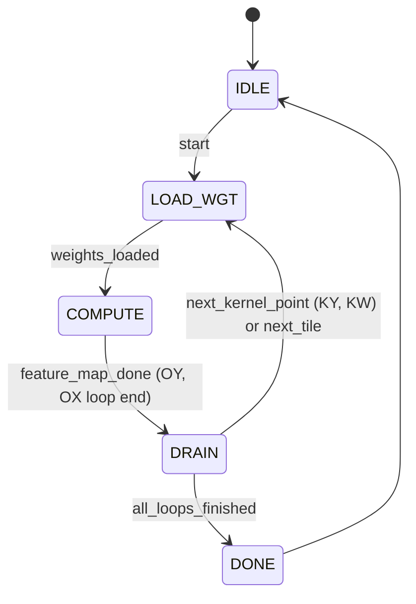

# Controller Design Specification

## 1. 概述 (Overview)

Controller 是 DNN 加速器的核心控制单元，负责解析配置参数、调度 PE Array 的计算流水线、生成存储器访问地址（AGU）以及管理数据流的同步。

### 主要职责
1.  **配置解析**: 解码层参数（Conv, Pooling, FC 等）。
2.  **分块调度 (Tiling)**: 将大规模的 Tensor 映射到 32x16 的物理阵列上。
3.  **地址生成 (AGU)**: 计算 Input/Output/Weight Buffer 的读写地址，处理 Padding、Stride 和 2-cycle 内存延迟。
4.  **流水线控制**: 生成 PE Array 的 `en`, `weight_we` 等控制信号，管理输入数据的 Skew 和输出数据的 De-skew。
5.  **后处理管理**: 集成 PPU (Post-Processing Unit)，控制 ReLU 激活和量化操作。

## 2. 配置参数 (Configuration Parameters)

Controller 通过一组寄存器接收以下配置信息：

| 参数类 | 参数名 | 位宽 | 描述 |
| :--- | :--- | :--- | :--- |
| **Layer** | `layer_type` | 2 | 00: Conv, 01: MaxPool, 10: AvgPool, 11: FC |
| | `relu_en` | 1 | ReLU 激活使能 |
| | `quant_shift` | 5 | 量化右移位数 (Floor模式) |
| | `cfg_is_max_pool` | 1 | **Max Pooling 模式使能** |
| **Feature** | `ifm_h`, `ifm_w` | 16 | 输入特征图高度/宽度 |
| | `ofm_h`, `ofm_w` | 16 | 输出特征图高度/宽度 |
| | `ic` | 16 | 输入通道数 (Input Channels) |
| | `oc` | 16 | 输出通道数 (Output Channels) |
| **Kernel** | `k_h`, `k_w` | 4 | 卷积核高度/宽度 |
| | `stride` | 4 | 步长 |
| | `pad_top`, `pad_left` | 4 | 零填充大小 |
| **Quant** | `precision` | 2 | 量化精度配置 (In/Out/Wgt) |

## 3. 调度策略 (Scheduling Strategy)

由于 PE Array 大小固定为 **32 (Rows/IC) x 16 (Cols/OC)**，对于超过此规模的层，采用 **Tiling (分块)** 策略。

### 3.1 循环嵌套顺序 (Loop Nesting)
为了最小化权重加载次数（Weight Stationary 特性）并优化流水线效率，采用以下循环顺序：

1.  **Loop `tile_oc`** (0 to `ceil(OC/16)`): 输出通道分块。
2.  **Loop `tile_ic`** (0 to `ceil(IC/32)`): 输入通道分块。
    *   *在此处加载权重 (Load Weights)*: 加载 32x16 的权重块。
    3.  **Loop `ky`** (0 to `k_h`): 卷积核行。
    4.  **Loop `kx`** (0 to `k_w`): 卷积核列。
        *   *在此处流式传输特征图 (Stream IFM)*: 遍历整张图。
        5.  **Loop `oy`** (0 to `ofm_h`): 输出特征图行。
        6.  **Loop `ox`** (0 to `ofm_w`): 输出特征图列。

**注意**: 这种循环顺序（Kernel Loop 在外，Feature Map Loop 在内）确保了对于同一个输出像素，其累加操作在时间上是分散的（相隔整个 Feature Map 的计算时间）。这消除了 Read-After-Write (RAW) 冒险，使得流水线可以全速运行。

### 3.2 累加与后处理 (Accumulation & Post-Processing)
*   **Partial Sum Accumulation**: 
    *   利用 OFM Buffer 的 **True Dual Port** 特性。
    *   **Read (Port B)**: 读取旧的部分和 (`acc_in`)。
    *   **Write (Port A)**: 写入新的累加值 (`ppu_out`)。
    *   **PPU Logic**: `Sum = psum_in + (is_first ? 0 : acc_in)`.
*   **Max Pooling**: 当 `cfg_is_max_pool` 置位时，PE Array 执行最大值操作。
*   **PPU Integration**:
    *   **Accumulation Phase**: 当不是最后一个 Kernel 点 (`is_last=0`) 时，PPU 输出原始累加值 (INT32)。
    *   **Final Phase**: 当是最后一个 Kernel 点 (`is_last=1`) 时，PPU 启用 ReLU 和 Quantization，输出最终结果。

## 4. 详细设计 (Detailed Design)

### 4.1 状态机 (FSM)



1.  **IDLE**: 等待启动信号。
2.  **LOAD_WGT**: 加载当前 Tile 和 Kernel 点对应的权重。
3.  **COMPUTE**: 
    *   遍历整个输出特征图 (OY, OX)。
    *   全速流水线运行 (100% Duty Cycle)，无 Throttling。
4.  **DRAIN**: 
    *   等待流水线排空。
    *   更新外部循环计数器 (KW -> KY -> Tile_IC -> Tile_OC)。
5.  **DONE**: 完成所有计算。

### 4.2 地址生成单元 (AGU)

考虑到 Buffer 读延迟为 **2 cycles**，AGU 需提前 2 个周期发出地址。

#### Input Buffer AGU
*   **Base Address**: `ifm_base_addr`
*   **Logic**:
    ```verilog
    // Current coordinate in IFM
    cur_iy = oy * stride + ky - pad_top;
    cur_ix = ox * stride + kx - pad_left;
    
    // Address calculation (Row-Major)
    if (cur_iy >= 0 && cur_iy < ifm_h && cur_ix >= 0 && cur_ix < ifm_w) begin
        is_pad = 0;
        addr_offset = (cur_iy * ifm_w + cur_ix) * IC + (tile_ic * 32);
        // Note: Need to fetch 32 channels in parallel or burst?
        // Assuming Input Buffer width supports 32 bytes parallel read, or we read sequentially.
        // For high performance, Input Buffer width should be 32 * 8-bit = 256-bit.
    end else begin
        is_pad = 1; // Mux 0 to PE input
    end
    ```

#### Output Buffer AGU
*   **Logic**:
    ```verilog
    // Output coordinate
    addr_offset = (oy * ofm_w + ox) * OC + (tile_oc * 16);
    // Assuming Output Buffer width supports 16 * 32-bit = 512-bit parallel access.
    ```

### 4.3 流水线时序与 Skew 处理

为了满足脉动阵列 `feature_in` 的阶梯化需求：

*   **Input Skew**:
    *   Controller 内部维护一个 FIFO 或移位寄存器组。
    *   从 Buffer 读出的 32 通道数据（假设一次读出）不能同时送入 PE。
    *   第 $i$ 行数据需延迟 $i$ 个周期。
    *   **优化**: 实际上，可以让 AGU 针对每一行有独立的地址计数器，或者利用 Buffer 的多 Bank 特性，错开读取时间。但最简单的做法是：**宽读入，寄存器延迟**。
    *   设计一个 `Skew_Buffer`: 输入 32x8bit，输出 32x8bit。第 $i$ 通道经过 $i$ 级寄存器。

*   **Output De-skew**:
    *   PE Array 输出的 `psum_out` 也是阶梯化的。
    *   第 $j$ 列的结果比第 0 列晚 $j$ 个周期到达。
    *   Controller 需设计 `De-skew_Buffer`: 第 $j$ 列经过 $(15-j)$ 级寄存器延迟，使得所有 16 列数据对齐，以便同时写入 Output Buffer。

### 4.4 并行化与吞吐量

*   **计算并行度**: 32 (IC) * 16 (OC) = 512 MACs/cycle。
*   **存储带宽需求**:
    *   **Input**: 每周期需提供 32 个 INT8 = 32 Bytes/cycle。
    *   **Output**: 每周期需读写 16 个 INT32 = 64 Bytes/cycle (Read + Write)。
    *   **Weight**: 加载阶段需高带宽，计算阶段为 0。

## 5. 特殊层处理

### 5.1 Pooling (Max/Avg)
*   **实现方式**: 
    *   Pooling 不使用 PE Array 的乘法功能。
    *   **方案 A (Bypass)**: 数据流经 PE Array 不变，在 PPU 中处理。
    *   **方案 B (Controller-based)**: Controller 直接从 Output Buffer 读取数据，执行 Pooling，写回。
    *   **推荐**: 使用 PPU。Controller 将 PE Array 设置为直通（Weight=1, Bias=0）或直接旁路，PPU 接收数据后进行比较/累加。
    *   *注意*: 如果是 Max Pooling，通常是在 Conv+ReLU 之后。Controller 可以在写回 Output Buffer 之前，在流水线上插入 Pooling 逻辑（Line Buffer）。

### 5.2 Fully Connected (FC)
*   **映射**: 视为 1x1 卷积。
    *   `ifm_h` = 1, `ifm_w` = 1.
    *   `ic` = Input Vector Size.
    *   `oc` = Output Vector Size.
    *   `k_h` = 1, `k_w` = 1.
*   调度逻辑与 Conv 完全一致。

## 6. 接口信号定义

```verilog
module controller (
    input wire clk,
    input wire rst_n,
    input wire start,
    input wire [CONFIG_WIDTH-1:0] config_data,
    output wire busy,
    output wire done,

    // PE Array Control
    output wire pe_en,
    output wire pe_rst_n,
    output wire [31:0] weight_we_row,
    
    // Buffer Interfaces (Simplified)
    output wire [31:0] ifm_addr,
    output wire ifm_rd_en,
    input wire [255:0] ifm_rdata, // 32 * 8bit
    
    output wire [31:0] wgt_addr,
    output wire wgt_rd_en,
    input wire [127:0] wgt_rdata, // 16 * 8bit (Load 1 row of weights at a time)
    
    output wire [31:0] ofm_addr,
    output wire ofm_wr_en,
    output wire ofm_rd_en,
    input wire [511:0] ofm_rdata, // 16 * 32bit
    output wire [511:0] ofm_wdata
);
```
