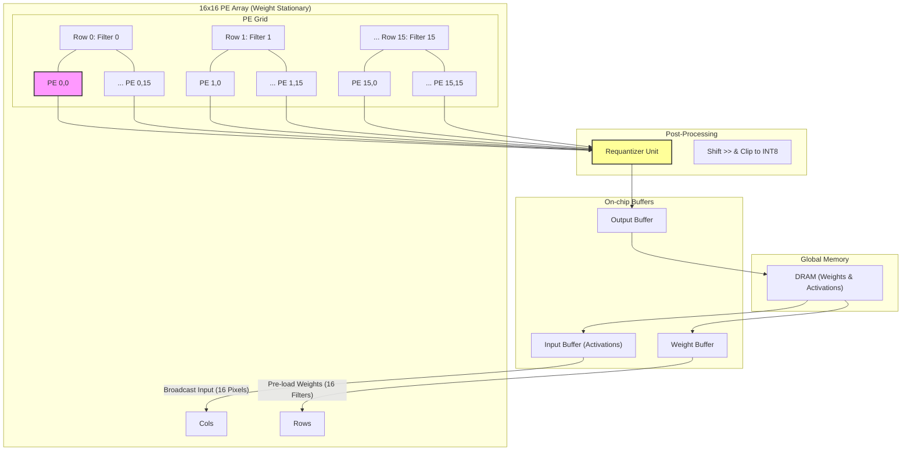
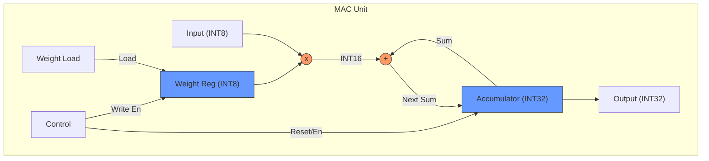

# Architecture Design

This document outlines the architecture design of the FPGA project, detailing the key components and their interactions within the system.

## Components
1. **Processing Element (PE)**: The core computational unit responsible for executing instructions and processing data.
2. **Address Generator Unit (AGU)**: Generates memory addresses for data access, ensuring efficient data retrieval and storage.
3. **Activation Buffer**: Temporarily holds activation data during processing to facilitate quick access and reduce latency.
4. **Weight Buffer**: Stores weight data used in computations, allowing for rapid access during
5. **Config Registers**: Hold configuration parameters that dictate the operation of the PE and other components.

## PE Array Architecture (16x16)

The system employs a **16x16 PE Array** (256 MAC units total) utilizing a **Weight Stationary** dataflow to maximize weight reuse and minimize off-chip memory access.

### Design Overview
*   **Dimensions**: 16 Rows × 16 Columns.
*   **Parallelism Strategy**:
    *   **Row Parallelism (Output Channels)**: Each row `i` computes Output Channel `i`.
    *   **Column Parallelism (Spatial Pixels)**: Each column `j` computes Spatial Pixel `j` (e.g., adjacent windows in the input feature map).
*   **Dataflow**:
    *   **Weights**: Pre-loaded into PE registers. Row `i` stores weights for Filter `i`.
    *   **Inputs**: Broadcast from Input Buffer to columns. Column `j` receives Input Window `j`.
    *   **Outputs**: Accumulated locally in INT32, then read out for requantization.

### PE Array Diagram

## MAC Unit Design

Each Processing Element (PE) contains a MAC unit designed for INT8 inference.

### Specifications
*   **Arithmetic**: INT8 Multiplication, INT32 Accumulation.
*   **Registers**: 
    *   `Weight Reg`: Stores the stationary weight.
    *   `Accumulator`: Stores the 32-bit partial sum.
*   **Logic**: `Acc = Acc + (Input * Weight)`.

### MAC Unit Diagram
